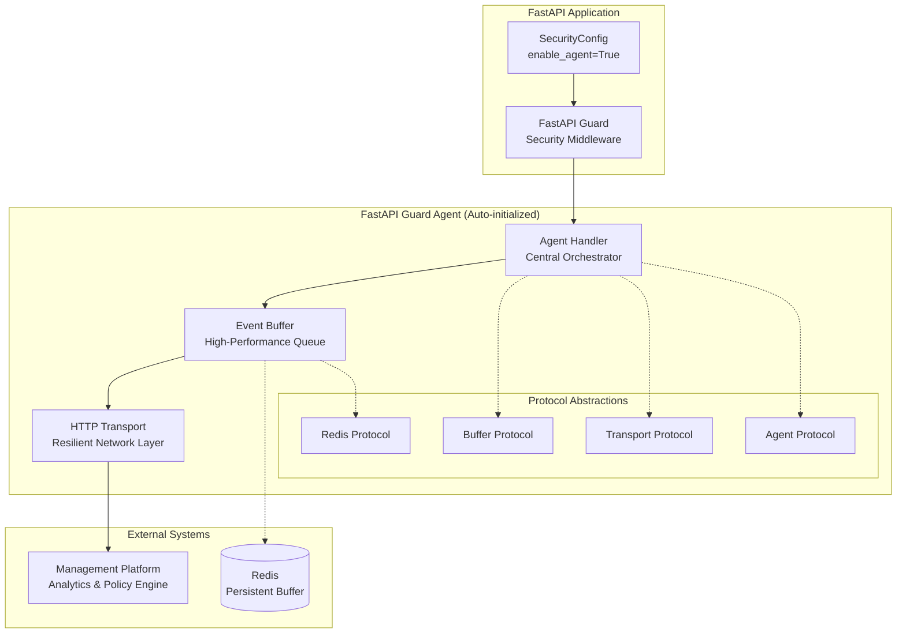

# API Overview

The FastAPI Guard Agent API provides a comprehensive, protocol-driven architecture for enterprise-grade security telemetry. Designed with extensibility and reliability at its core, the API enables seamless integration with diverse monitoring ecosystems while maintaining strict performance guarantees.

## System Architecture

The agent implements a layered architecture optimized for high-throughput telemetry collection with minimal application impact:



## Core Components

### 1. Agent Handler (`GuardAgentHandler`)

The central orchestration component responsible for coordinating all telemetry operations.

**Core Responsibilities:**
- **Lifecycle Management**: Orchestrates initialization, operation, and graceful shutdown sequences
- **Event Processing**: Implements high-throughput event ingestion with backpressure handling
- **Metric Aggregation**: Performs efficient metric collection with configurable sampling rates
- **Task Coordination**: Manages asynchronous operations including buffer flushing and policy synchronization

**Basic Usage (Auto-integrated with FastAPI Guard):**
```python
from fastapi import FastAPI
from guard import SecurityConfig, SecurityMiddleware

# Configure with agent enabled
config = SecurityConfig(
    enable_agent=True,
    agent_api_key="your-api-key",
    agent_project_id="your-project-id",
    agent_endpoint="https://api.fastapi-guard.com",
)

app = FastAPI()
middleware = SecurityMiddleware(app, config=config)
# Agent starts automatically with middleware
```

**Direct Usage (Advanced):**
```python
from guard_agent import guard_agent, AgentConfig

# Initialize directly
config = AgentConfig(
    api_key="your-api-key",
    project_id="your-project-id",
)
agent = guard_agent(config)

# Lifecycle
await agent.start()
await agent.stop()

# Send data manually
await agent.send_event(security_event)
await agent.send_metric(performance_metric)
```

### 2. Event Buffer (`EventBuffer`)

High-performance buffering subsystem engineered for optimal throughput and reliability.

**Technical Capabilities:**
- **Lock-Free Architecture**: Utilizes deque-based storage for minimal contention
- **Persistent Buffering**: Optional Redis integration for durability across restarts
- **Intelligent Flushing**: Adaptive algorithms balance latency and efficiency
- **Concurrency Safety**: Full async/await compatibility with thread-safe operations

**Usage Patterns:**
```python
from guard_agent.buffer import EventBuffer
from guard_agent.models import SecurityEvent

# Create buffer
buffer = EventBuffer(
    max_size=1000,
    flush_interval=60,
    redis_handler=redis_client  # optional
)

# Add events
await buffer.add_event(security_event)
await buffer.add_metric(performance_metric)

# Manual flush
events, metrics = await buffer.flush()
```

### 3. HTTP Transport (`HTTPTransport`)

Enterprise-grade network layer implementing industry best practices for reliable data delivery.

**Reliability Features:**
- **Intelligent Retry**: Exponential backoff with jitter prevents thundering herd
- **Circuit Breaker**: Automatic failure detection with graceful degradation
- **Adaptive Rate Limiting**: Dynamic throttling based on backend capacity
- **Comprehensive Telemetry**: Real-time transport statistics for operational visibility

**Configuration:**
```python
from guard_agent.transport import HTTPTransport

transport = HTTPTransport(
    backend_url="https://your-backend.com",
    api_key="your-api-key",
    timeout=30,
    max_retries=3,
    backoff_factor=2.0,
    rate_limit_requests=100,
    rate_limit_period=60
)
```

### 4. Data Models

Strongly-typed data structures leveraging Pydantic for validation and serialization.

**Primary Models:**
- `AgentConfig`: Comprehensive configuration with validation and defaults
- `SecurityEvent`: Rich security event representation with contextual metadata
- `SecurityMetric`: Performance metrics with dimensional tagging support
- `EventBatch`: Optimized batch container for network efficiency
- `AgentStatus`: Real-time operational telemetry and health indicators

### 5. Protocol System

Clean abstraction layer enabling custom implementations while maintaining compatibility.

**Protocol Interfaces:**
- `AgentHandlerProtocol`: Defines agent lifecycle and event handling contracts
- `BufferProtocol`: Specifies buffering semantics and performance guarantees
- `TransportProtocol`: Establishes network transport requirements and capabilities
- `RedisHandlerProtocol`: Standardizes persistent storage integration patterns

## API Reference by Module

### Core Handler API

#### `GuardAgentHandler`

The main entry point for all agent operations.

```python
class GuardAgentHandler:
    def __init__(self, config: AgentConfig) -> None: ...

    # Lifecycle Management
    async def start(self) -> None: ...
    async def stop(self) -> None: ...
    async def is_running(self) -> bool: ...

    # Event & Metric Handling
    async def send_event(self, event: SecurityEvent) -> None: ...
    async def send_metric(self, metric: SecurityMetric) -> None: ...

    # Status & Health
    async def get_status(self) -> AgentStatus: ...
    async def health_check(self) -> bool: ...

    # Configuration
    async def update_config(self, config: AgentConfig) -> None: ...
    async def get_dynamic_rules(self) -> DynamicRules: ...
```

**Key Methods:**

| Method | Description | Usage |
|--------|-------------|-------|
| `start()` | Initialize agent and start background tasks | Called on app startup |
| `stop()` | Graceful shutdown with data preservation | Called on app shutdown |
| `send_event()` | Send security event to buffer | Auto-called by FastAPI Guard |
| `send_metric()` | Send performance metric | Manual or auto collection |
| `get_status()` | Get real-time agent status | Health monitoring |

### Buffer API

#### `EventBuffer`

Intelligent event and metric buffering with persistence.

```python
class EventBuffer:
    def __init__(
        self,
        max_size: int = 1000,
        flush_interval: int = 60,
        redis_handler: Optional[RedisHandlerProtocol] = None
    ) -> None: ...

    # Data Management
    async def add_event(self, event: SecurityEvent) -> None: ...
    async def add_metric(self, metric: SecurityMetric) -> None: ...
    async def flush(self) -> Tuple[List[SecurityEvent], List[SecurityMetric]]: ...

    # Status & Configuration
    def get_stats(self) -> Dict[str, Any]: ...
    async def clear(self) -> None: ...
    def is_full(self) -> bool: ...
```

### Transport API

#### `HTTPTransport`

Enterprise-grade HTTP client with resilience features.

```python
class HTTPTransport:
    def __init__(
        self,
        backend_url: str,
        api_key: str,
        timeout: int = 30,
        max_retries: int = 3,
        backoff_factor: float = 2.0
    ) -> None: ...

    # Data Transmission
    async def send_batch(self, batch: EventBatch) -> bool: ...
    async def send_heartbeat(self, status: AgentStatus) -> bool: ...

    # Health & Status
    async def test_connection(self) -> bool: ...
    def get_stats(self) -> TransportStats: ...

    # Configuration
    async def update_rules(self) -> Optional[DynamicRules]: ...
```

### Models API

#### Core Data Models

**AgentConfig**
```python
class AgentConfig(BaseModel):
    backend_url: str
    api_key: str
    buffer_size: int = 1000
    flush_interval: int = 60
    enabled: bool = True
    # ... additional fields
```

**SecurityEvent**
```python
class SecurityEvent(BaseModel):
    event_type: EventType
    source_ip: str
    timestamp: datetime
    description: str
    metadata: Optional[Dict[str, Any]] = None
    # ... additional fields
```

**SecurityMetric**
```python
class SecurityMetric(BaseModel):
    metric_type: MetricType
    value: Union[int, float]
    timestamp: datetime
    metadata: Optional[Dict[str, Any]] = None
    # ... additional fields
```

## Implementation Patterns

### Pattern 1: Standard Deployment

```python
from fastapi import FastAPI
from guard import SecurityConfig, SecurityMiddleware

app = FastAPI()

# Configure FastAPI Guard with agent
config = SecurityConfig(
    # Enable agent
    enable_agent=True,
    agent_api_key="your-api-key",
    agent_project_id="your-project-id",

    # Security settings
    enable_rate_limiting=True,
    enable_ip_banning=True,
    enable_penetration_detection=True,
)

# Add middleware - agent starts automatically
middleware = SecurityMiddleware(app, config=config)
```

### Pattern 2: Custom Event Integration

```python
from guard_agent import guard_agent, AgentConfig, SecurityEvent
from guard_agent.utils import get_current_timestamp

# Get agent instance
config = AgentConfig(
    api_key="your-api-key",
    project_id="your-project-id",
)
agent = guard_agent(config)

async def custom_security_check(request):
    """Custom security validation with event reporting."""

    if is_suspicious(request):
        # Create custom event
        event = SecurityEvent(
            timestamp=get_current_timestamp(),
            event_type="custom_rule_triggered",
            ip_address=request.client.host,
            action_taken="blocked",
            reason="Custom security check failed",
            endpoint=str(request.url.path),
            method=request.method,
            metadata={
                "check_type": "business_logic",
                "severity": "high"
            }
        )

        # Send to agent
        await agent.send_event(event)

        return False

    return True
```

### Pattern 3: Performance Monitoring

```python
from guard_agent import guard_agent, SecurityMetric
from guard_agent.utils import get_current_timestamp
import time

# Get agent instance (singleton)
agent = guard_agent(AgentConfig(
    api_key="your-api-key",
    project_id="your-project-id",
))

async def monitor_endpoint_performance():
    """Monitor endpoint performance and send metrics."""

    start_time = time.time()

    try:
        # Your endpoint logic
        result = await process_request()

        # Success metric
        await agent.send_metric(SecurityMetric(
            timestamp=get_current_timestamp(),
            metric_type="response_time",
            value=time.time() - start_time,
            endpoint="/api/process",
            tags={"status": "success"}
        ))

        return result

    except Exception as e:
        # Error metric
        await agent.send_metric(SecurityMetric(
            timestamp=get_current_timestamp(),
            metric_type="error_rate",
            value=1.0,
            endpoint="/api/process",
            tags={"error": str(type(e).__name__)}
        ))
        raise
```

### Pattern 4: Health Monitoring

```python
@app.get("/health")
async def health_check():
    """Application health check including agent status."""

    agent_healthy = await agent.health_check()
    agent_status = await agent.get_status()

    return {
        "status": "healthy" if agent_healthy else "degraded",
        "agent": {
            "running": agent_status.is_running,
            "events_processed": agent_status.events_processed,
            "last_flush": agent_status.last_flush_time,
            "buffer_size": agent_status.buffer_size
        }
    }
```

## Reliability Patterns

### Graceful Degradation

The agent implements comprehensive failure isolation to protect application availability:

```python
try:
    await agent.send_event(event)
except Exception as e:
    # Agent failure doesn't break your app
    logger.warning(f"Agent error: {e}")
    # Application continues normally
```

### Circuit Breaker Implementation

Advanced failure detection with automatic recovery mechanisms:

```python
# Circuit breaker state machine:
# - CLOSED: Normal operation with request forwarding
# - OPEN: Fast-fail mode preventing backend overload
# - HALF_OPEN: Controlled recovery testing with limited traffic
```

### Retry Strategies

Sophisticated retry algorithms optimize for both reliability and backend protection:

```python
# Adaptive retry configuration:
max_retries: 3                    # Configurable retry limit
backoff_factor: 2.0              # Exponential growth factor
jitter: True                     # Randomization prevents synchronized retries
max_delay: 60                    # Caps maximum retry delay
```

## Performance Engineering

### Memory Optimization

Strategic memory management for various deployment scales:

- **Buffer Sizing**: Dynamic sizing based on traffic patterns and memory constraints
- **Flush Strategies**: Adaptive algorithms balance latency requirements with efficiency
- **Persistent Buffering**: Redis integration for memory-constrained environments

### Network Optimization

Advanced techniques minimize bandwidth and latency:

- **Intelligent Batching**: Adaptive batch sizes based on network conditions
- **Compression**: Automatic gzip compression for payload optimization
- **Connection Management**: HTTP/2 multiplexing with connection pooling

### Deployment Profiles

```python
# Microservice deployment (low memory, high frequency)
config = AgentConfig(buffer_size=100, flush_interval=10)

# Standard API service (balanced profile)
config = AgentConfig(buffer_size=1000, flush_interval=30)

# High-throughput gateway (optimized for volume)
config = AgentConfig(buffer_size=10000, flush_interval=60)
```
