# API Overview

FastAPI Guard Agent provides a clean, extensible API for collecting and transmitting security events and metrics from your FastAPI Guard implementation to monitoring backends.

## Architecture Overview

The agent follows a modular, protocol-based architecture designed for reliability, performance, and extensibility:

```mermaid
graph TB
    subgraph "FastAPI Application"
        FG[FastAPI Guard<br/>Middleware]
    end

    subgraph "FastAPI Guard Agent"
        AH[Agent Handler<br/>🎯 Central coordinator]
        EB[Event Buffer<br/>📊 Temporary storage]
        TR[HTTP Transport<br/>🚀 Network layer]

        subgraph "Protocols"
            BP[Buffer Protocol]
            TP[Transport Protocol]
            RP[Redis Protocol]
            AP[Agent Protocol]
        end
    end

    subgraph "Storage & Network"
        RD[(Redis<br/>💾 Persistence)]
        BE[Backend Service<br/>☁️ Your monitoring system]
    end

    FG --> AH
    AH --> EB
    EB --> TR
    EB -.-> RD
    TR --> BE

    AH -.-> BP
    AH -.-> TP
    EB -.-> RP
    AH -.-> AP
```



## Core Components

### 1. Agent Handler (`GuardAgentHandler`)

The central coordinator that manages the entire agent lifecycle.

**Key Responsibilities:**
- 🎯 **Lifecycle Management**: Start, stop, and health monitoring
- 🔄 **Event Processing**: Receives events from FastAPI Guard
- 📊 **Metric Collection**: Gathers performance and security metrics
- 🕹️ **Background Tasks**: Manages flushing, status updates, and rule fetching

**Basic Usage:**
```python
from guard_agent import GuardAgentHandler
from guard_agent.models import AgentConfig

# Initialize
config = AgentConfig(
    backend_url="https://your-backend.com",
    api_key="your-api-key"
)
handler = GuardAgentHandler(config)

# Lifecycle
await handler.start()
await handler.stop()

# Send data
await handler.send_event(security_event)
await handler.send_metric(performance_metric)
```

### 2. Event Buffer (`EventBuffer`)

Intelligent buffering system with persistence and auto-flushing capabilities.

**Key Features:**
- 📊 **Deque-based Storage**: Efficient in-memory buffering
- 💾 **Redis Persistence**: Optional persistent storage
- ⏰ **Auto-flushing**: Time and size-based triggers
- 🔒 **Thread Safety**: Async-safe operations

**Usage Patterns:**
```python
from guard_agent.buffer import EventBuffer
from guard_agent.models import SecurityEvent

# Create buffer
buffer = EventBuffer(
    max_size=1000,
    flush_interval=60,
    redis_handler=redis_client  # optional
)

# Add events
await buffer.add_event(security_event)
await buffer.add_metric(performance_metric)

# Manual flush
events, metrics = await buffer.flush()
```

### 3. HTTP Transport (`HTTPTransport`)

Resilient HTTP client with enterprise-grade reliability features.

**Key Features:**
- 🔄 **Retry Logic**: Exponential backoff with jitter
- ⚡ **Circuit Breaker**: Prevents cascade failures
- 🚦 **Rate Limiting**: Configurable request throttling
- 📊 **Statistics**: Detailed performance metrics

**Configuration:**
```python
from guard_agent.transport import HTTPTransport

transport = HTTPTransport(
    backend_url="https://your-backend.com",
    api_key="your-api-key",
    timeout=30,
    max_retries=3,
    backoff_factor=2.0,
    rate_limit_requests=100,
    rate_limit_period=60
)
```

### 4. Data Models

Type-safe Pydantic models for all data structures.

**Core Models:**
- `AgentConfig`: Agent configuration and settings
- `SecurityEvent`: Security incidents and violations
- `SecurityMetric`: Performance and telemetry data
- `EventBatch`: Batch container for efficient transmission
- `AgentStatus`: Real-time agent health information

### 5. Protocol System

Extensible protocol definitions for custom implementations.

**Available Protocols:**
- `AgentHandlerProtocol`: Agent handler interface
- `BufferProtocol`: Buffer implementation interface
- `TransportProtocol`: Transport layer interface
- `RedisHandlerProtocol`: Redis integration interface

## API Reference by Module

### Core Handler API

#### `GuardAgentHandler`

The main entry point for all agent operations.

```python
class GuardAgentHandler:
    def __init__(self, config: AgentConfig) -> None: ...

    # Lifecycle Management
    async def start(self) -> None: ...
    async def stop(self) -> None: ...
    async def is_running(self) -> bool: ...

    # Event & Metric Handling
    async def send_event(self, event: SecurityEvent) -> None: ...
    async def send_metric(self, metric: SecurityMetric) -> None: ...

    # Status & Health
    async def get_status(self) -> AgentStatus: ...
    async def health_check(self) -> bool: ...

    # Configuration
    async def update_config(self, config: AgentConfig) -> None: ...
    async def get_dynamic_rules(self) -> DynamicRules: ...
```

**Key Methods:**

| Method | Description | Usage |
|--------|-------------|-------|
| `start()` | Initialize agent and start background tasks | Called on app startup |
| `stop()` | Graceful shutdown with data preservation | Called on app shutdown |
| `send_event()` | Send security event to buffer | Auto-called by FastAPI Guard |
| `send_metric()` | Send performance metric | Manual or auto collection |
| `get_status()` | Get real-time agent status | Health monitoring |

### Buffer API

#### `EventBuffer`

Intelligent event and metric buffering with persistence.

```python
class EventBuffer:
    def __init__(
        self,
        max_size: int = 1000,
        flush_interval: int = 60,
        redis_handler: Optional[RedisHandlerProtocol] = None
    ) -> None: ...

    # Data Management
    async def add_event(self, event: SecurityEvent) -> None: ...
    async def add_metric(self, metric: SecurityMetric) -> None: ...
    async def flush(self) -> Tuple[List[SecurityEvent], List[SecurityMetric]]: ...

    # Status & Configuration
    def get_stats(self) -> Dict[str, Any]: ...
    async def clear(self) -> None: ...
    def is_full(self) -> bool: ...
```

### Transport API

#### `HTTPTransport`

Enterprise-grade HTTP client with resilience features.

```python
class HTTPTransport:
    def __init__(
        self,
        backend_url: str,
        api_key: str,
        timeout: int = 30,
        max_retries: int = 3,
        backoff_factor: float = 2.0
    ) -> None: ...

    # Data Transmission
    async def send_batch(self, batch: EventBatch) -> bool: ...
    async def send_heartbeat(self, status: AgentStatus) -> bool: ...

    # Health & Status
    async def test_connection(self) -> bool: ...
    def get_stats(self) -> TransportStats: ...

    # Configuration
    async def update_rules(self) -> Optional[DynamicRules]: ...
```

### Models API

#### Core Data Models

**AgentConfig**
```python
class AgentConfig(BaseModel):
    backend_url: str
    api_key: str
    buffer_size: int = 1000
    flush_interval: int = 60
    enabled: bool = True
    # ... additional fields
```

**SecurityEvent**
```python
class SecurityEvent(BaseModel):
    event_type: EventType
    source_ip: str
    timestamp: datetime
    description: str
    metadata: Optional[Dict[str, Any]] = None
    # ... additional fields
```

**SecurityMetric**
```python
class SecurityMetric(BaseModel):
    metric_type: MetricType
    value: Union[int, float]
    timestamp: datetime
    metadata: Optional[Dict[str, Any]] = None
    # ... additional fields
```

## Common Usage Patterns

### Pattern 1: Basic Integration

```python
from fastapi import FastAPI
from guard import SecurityMiddleware
from guard_agent import GuardAgentHandler
from guard_agent.models import AgentConfig

app = FastAPI()

# Configure agent
config = AgentConfig(
    backend_url="https://your-backend.com",
    api_key="your-api-key"
)
agent = GuardAgentHandler(config)

# Add to middleware
middleware_config = SecurityMiddleware.Config(
    agent_handler=agent
)
app.add_middleware(SecurityMiddleware, config=middleware_config)

@app.on_event("startup")
async def startup():
    await agent.start()

@app.on_event("shutdown")
async def shutdown():
    await agent.stop()
```

### Pattern 2: Custom Event Processing

```python
from guard_agent.models import SecurityEvent, EventType

async def custom_security_check(request):
    """Custom security validation with event reporting."""

    # Your custom logic
    if is_suspicious(request):
        # Create custom event
        event = SecurityEvent(
            event_type=EventType.CUSTOM,
            source_ip=get_client_ip(request),
            description="Custom security check failed",
            metadata={
                "check_type": "business_logic",
                "details": get_check_details()
            }
        )

        # Send to agent
        await agent.send_event(event)

        return False

    return True
```

### Pattern 3: Performance Monitoring

```python
from guard_agent.models import SecurityMetric, MetricType
import time

async def monitor_endpoint_performance():
    """Monitor endpoint performance and send metrics."""

    start_time = time.time()

    try:
        # Your endpoint logic
        result = await process_request()

        # Success metric
        await agent.send_metric(SecurityMetric(
            metric_type=MetricType.RESPONSE_TIME,
            value=time.time() - start_time,
            metadata={"status": "success"}
        ))

        return result

    except Exception as e:
        # Error metric
        await agent.send_metric(SecurityMetric(
            metric_type=MetricType.ERROR_COUNT,
            value=1,
            metadata={"error": str(e)}
        ))
        raise
```

### Pattern 4: Health Monitoring

```python
@app.get("/health")
async def health_check():
    """Application health check including agent status."""

    agent_healthy = await agent.health_check()
    agent_status = await agent.get_status()

    return {
        "status": "healthy" if agent_healthy else "degraded",
        "agent": {
            "running": agent_status.is_running,
            "events_processed": agent_status.events_processed,
            "last_flush": agent_status.last_flush_time,
            "buffer_size": agent_status.buffer_size
        }
    }
```

## Error Handling

### Graceful Degradation

The agent is designed to fail gracefully without affecting your application:

```python
try:
    await agent.send_event(event)
except Exception as e:
    # Agent failure doesn't break your app
    logger.warning(f"Agent error: {e}")
    # Application continues normally
```

### Circuit Breaker Pattern

The HTTP transport includes a circuit breaker to prevent cascade failures:

```python
# Circuit breaker states:
# - CLOSED: Normal operation
# - OPEN: Failing fast, not attempting requests
# - HALF_OPEN: Testing if service is back
```

### Retry Strategies

Built-in retry logic with exponential backoff:

```python
# Retry configuration
max_retries: 3
backoff_factor: 2.0  # 1s, 2s, 4s delays
jitter: True  # Add randomness to prevent thundering herd
```

## Performance Considerations

### Memory Usage

- **Buffer Size**: Configure based on your traffic volume
- **Flush Frequency**: Balance between real-time data and efficiency
- **Redis Usage**: Optional for high-volume scenarios

### Network Efficiency

- **Batching**: Events are sent in batches to reduce overhead
- **Compression**: HTTP transport supports gzip compression
- **Keep-Alive**: Connection pooling for better performance

### Resource Management

```python
# Example configuration for different scales
# Small application
config = AgentConfig(buffer_size=100, flush_interval=30)

# Medium application
config = AgentConfig(buffer_size=1000, flush_interval=60)

# High-volume application
config = AgentConfig(buffer_size=5000, flush_interval=120)
```

## Next Steps

- 📖 **[Agent Handler API](agent-handler.md)** - Detailed handler documentation
- 📊 **[Event Buffer API](event-buffer.md)** - Buffer management details
- 🚀 **[Transport API](transport.md)** - HTTP transport configuration
- 🏗️ **[Models API](models.md)** - Complete data model reference
- 🔌 **[Protocols API](protocols.md)** - Extension interfaces
- 🛠️ **[Utilities API](utilities.md)** - Helper functions and tools

## Support

For detailed implementation examples and advanced patterns, see:

- 📚 **[Examples](../examples/index.md)** - Practical implementation examples
- 📖 **[Integration Guide](../tutorial/integration.md)** - Advanced integration patterns
- 🔧 **[Troubleshooting](../guides/troubleshooting.md)** - Common issues and solutions