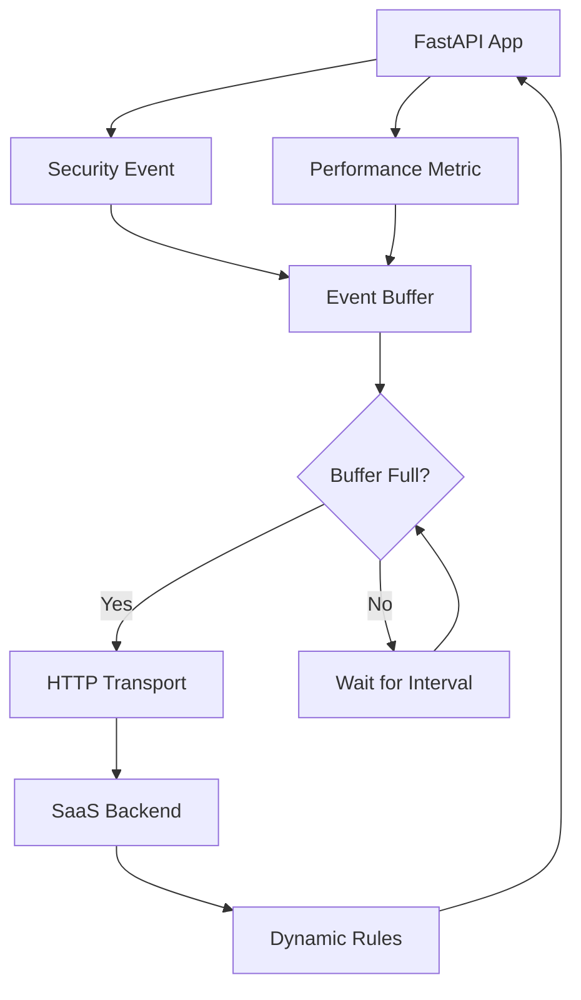

# Getting Started

This comprehensive guide provides a systematic approach to deploying FastAPI Guard Agent within your application infrastructure. Upon completion, you will have established a production-ready security telemetry pipeline capable of real-time threat detection and response.

## Architecture Overview

The FastAPI Guard Agent operates as an intelligent telemetry layer within your security infrastructure, providing:

1. **Automated Collection** - Captures security events and performance metrics through deep integration with FastAPI Guard middleware
2. **Intelligent Buffering** - Implements multi-tier data management with memory and persistent storage options for optimal performance
3. **Reliable Transmission** - Ensures guaranteed delivery of telemetry data through enterprise-grade transport mechanisms
4. **Dynamic Configuration** - Enables real-time security policy updates without service interruption

## Prerequisites

### System Requirements

- **Python Runtime**: Version 3.8 or higher (3.11+ recommended for optimal performance)
- **Package Installation**: FastAPI Guard Agent via pip ([Installation Guide](../installation.md))
- **Application Framework**: Existing or new FastAPI application
- **Authentication**: Valid API credentials from the FastAPI Guard management platform
- **Optional Components**: Redis 6.0+ for persistent buffering in production environments

## Implementation Guide

### Step 1: Standard Integration Pattern

The recommended deployment leverages FastAPI Guard's native agent support for automatic telemetry collection:

```python
# main.py
from fastapi import FastAPI
from guard import SecurityConfig, SecurityMiddleware

app = FastAPI(title="My Secure API")

# Configure FastAPI Guard with agent enabled
config = SecurityConfig(
    # Basic security settings
    auto_ban_threshold=5,
    auto_ban_duration=300,
    enable_rate_limiting=True,
    rate_limit=100,
    rate_limit_window=60,

    # Enable agent for telemetry
    enable_agent=True,
    agent_api_key="your-api-key-here",      # Replace with your actual API key
    agent_project_id="your-project-id",     # Replace with your project ID
    agent_endpoint="https://api.fastapi-guard.com",  # Default SaaS endpoint

    # Agent configuration
    agent_buffer_size=100,                  # Buffer up to 100 events
    agent_flush_interval=30,                # Send data every 30 seconds
    agent_enable_events=True,               # Enable security event collection
    agent_enable_metrics=True,              # Enable performance metrics

    # Enable dynamic rules from SaaS
    enable_dynamic_rules=True,
    dynamic_rule_interval=300,              # Check for rule updates every 5 minutes
)

# Add security middleware - agent starts automatically
middleware = SecurityMiddleware(app, config=config)

@app.get("/")
async def root():
    return {"message": "Hello, World!"}

@app.get("/health")
async def health():
    return {"status": "healthy", "agent_enabled": config.enable_agent}
```

With this configuration, the agent provides:
- Comprehensive security event capture across all middleware operations
- Real-time performance telemetry with sub-second granularity
- Automatic synchronization of security policies from the management platform

### Step 2: Configuration Architecture

The agent configuration is seamlessly integrated within FastAPI Guard's SecurityConfig, providing a unified interface for all security settings:

```python
from guard import SecurityConfig

config = SecurityConfig(
    # Agent-specific settings (prefix: agent_)
    enable_agent=True,                    # Enable/disable agent
    agent_api_key="your-api-key",         # Your SaaS platform API key
    agent_project_id="your-project-id",   # Your project identifier
    agent_endpoint="https://api.fastapi-guard.com",  # SaaS platform endpoint
    agent_buffer_size=100,                # Max events in memory buffer
    agent_flush_interval=30,              # Seconds between data transmissions
    agent_enable_events=True,             # Collect security events
    agent_enable_metrics=True,            # Collect performance metrics
    agent_retry_attempts=3,               # HTTP retry attempts
    agent_timeout=30,                     # HTTP request timeout

    # Dynamic rules settings
    enable_dynamic_rules=True,            # Enable dynamic rule fetching
    dynamic_rule_interval=300,            # Seconds between rule updates

    # Standard FastAPI Guard settings
    enable_rate_limiting=True,
    enable_ip_banning=True,
    enable_penetration_detection=True,
    # ... other security settings
)
```

### Step 3: Data Flow Architecture

The agent implements a sophisticated data pipeline designed for reliability and performance:



**Pipeline Components:**

1. **Event Generation**: Security violations and performance metrics are captured at the middleware layer
2. **Intelligent Buffering**: Multi-tier buffering system optimizes for both latency and throughput
3. **Batch Transmission**: Efficient batching algorithms minimize network overhead while maintaining low latency
4. **Backend Processing**: Cloud-based analytics engine processes telemetry for threat detection and policy updates
5. **Policy Synchronization**: Updated security rules are atomically applied without service disruption

### Step 4: Advanced Security Controls

FastAPI Guard's decorator system provides granular security controls with automatic telemetry integration:

```python
from fastapi import FastAPI
from guard import SecurityConfig, SecurityMiddleware
from guard.decorators import SecurityDecorator

app = FastAPI(title="My Secure API with Enhanced Security")

# Configure with agent
config = SecurityConfig(
    enable_agent=True,
    agent_api_key="your-api-key",
    agent_project_id="your-project-id",
    # ... other settings
)

middleware = SecurityMiddleware(app, config=config)
guard = SecurityDecorator(config)

# Connect decorator to middleware for behavioral tracking
middleware.set_decorator_handler(guard)

@app.get("/")
async def root():
    return {"message": "Hello, World!"}

@app.get("/public")
@guard.rate_limit(requests=5, window=60)
async def public_endpoint():
    """Rate limited endpoint - events sent automatically to agent."""
    return {"message": "This endpoint has rate limiting"}

@app.get("/admin")
@guard.require_ip(whitelist=["127.0.0.1", "10.0.0.0/8"])
@guard.rate_limit(requests=2, window=300)
async def admin_endpoint():
    """Admin endpoint with IP restrictions - all violations logged to agent."""
    return {"message": "Admin access granted"}

@app.get("/api/sensitive")
@guard.rate_limit(requests=3, window=600)
@guard.block_countries(["CN", "RU"])
async def sensitive_api():
    """Sensitive API with multiple security layers."""
    return {"message": "Sensitive data accessed"}
```

### Step 5: Deployment Validation

Comprehensive testing ensures proper agent operation:

1. **Application Startup**:
   ```bash
   uvicorn main:app --reload --log-level info
   ```

2. **Functional Verification**:
   ```bash
   # Baseline connectivity test
   curl http://localhost:8000/

   # Security event generation
   curl -X POST http://localhost:8000/api/sensitive -d "test_injection"

   # Performance metric generation
   curl http://localhost:8000/api/heavy-operation

   # Agent health verification
   curl http://localhost:8000/health
   ```

3. **Log Analysis**: Verify proper initialization:
   ```
   INFO:     FastAPI Guard security middleware initialized
   INFO:     Agent telemetry pipeline established
   INFO:     Dynamic rule synchronization active
   ```

4. **Automatic Event Categories**: The agent captures:
   - Rate limiting violations with request metadata
   - IP-based access control events
   - Geographic restriction violations
   - Pattern-based threat detection
   - Authentication and authorization failures
   - Custom security rule triggers

## Deployment Patterns

### Environment-Specific Configuration

**Development Environment:**
```python
# config_dev.py
from guard import SecurityConfig

dev_config = SecurityConfig(
    # Development agent settings
    enable_agent=True,
    agent_api_key="dev-api-key",
    agent_project_id="my-app-dev",
    agent_buffer_size=10,          # Small buffer for immediate feedback
    agent_flush_interval=5,        # Frequent flushes for testing

    # Security settings for dev
    enable_rate_limiting=True,
    rate_limit=1000,               # Higher limits for testing
    enable_ip_banning=False,       # Disable banning in dev
)
```

**Production Environment:**
```python
# config_prod.py
from guard import SecurityConfig

prod_config = SecurityConfig(
    # Production agent settings
    enable_agent=True,
    agent_api_key="prod-api-key",
    agent_project_id="my-app-prod",
    agent_buffer_size=500,         # Larger buffer for efficiency
    agent_flush_interval=60,       # Less frequent flushes
    agent_retry_attempts=5,        # More retries for reliability

    # Security settings for production
    enable_rate_limiting=True,
    rate_limit=100,
    enable_ip_banning=True,
    auto_ban_threshold=5,
    enable_penetration_detection=True,

    # Enable dynamic rules in production
    enable_dynamic_rules=True,
    dynamic_rule_interval=300,
)
```

### Fault Tolerance

The agent implements comprehensive error handling to ensure application stability:

```python
from fastapi import FastAPI
from guard import SecurityConfig, SecurityMiddleware

app = FastAPI()

# Even if agent fails, your app continues running
config = SecurityConfig(
    enable_agent=True,
    agent_api_key="your-api-key",
    agent_project_id="your-project-id",
    # ... other settings
)

try:
    middleware = SecurityMiddleware(app, config=config)
    logger.info("Security middleware initialized with telemetry pipeline")
except Exception as e:
    logger.warning(f"Telemetry initialization failed: {e}")
    # Application continues with security enforcement but without telemetry
```

### Custom Event Handling (Advanced)

For scenarios requiring custom business logic events beyond standard security violations:

```python
from guard_agent import guard_agent, AgentConfig, SecurityEvent
from guard_agent.utils import get_current_timestamp

# Get agent instance (singleton)
config = AgentConfig(
    api_key="your-api-key",
    project_id="your-project-id",
)
agent = guard_agent(config)

# Manually start/stop if not using FastAPI Guard
@app.on_event("startup")
async def startup():
    await agent.start()

@app.on_event("shutdown")
async def shutdown():
    await agent.stop()

# Send custom events
@app.post("/custom-action")
async def custom_action(request: Request):
    # Your business logic here

    # Send custom event
    event = SecurityEvent(
        timestamp=get_current_timestamp(),
        event_type="custom_rule_triggered",
        ip_address=request.client.host,
        action_taken="logged",
        reason="Custom business rule",
        endpoint="/custom-action",
        method="POST",
        metadata={
            "custom_field": "custom_value",
            "user_agent": request.headers.get("user-agent", ""),
        }
    )
    await agent.send_event(event)

    return {"status": "success"}
```

## Integration Testing

Create a simple test to verify your integration:

```python
# test_integration.py
import pytest
from httpx import AsyncClient
from main import app

@pytest.mark.asyncio
async def test_fastapi_guard_with_agent():
    """Test that FastAPI Guard with agent works correctly."""

    async with AsyncClient(app=app, base_url="http://test") as client:
        # Test normal endpoint
        response = await client.get("/")
        assert response.status_code == 200

        # Test rate limited endpoint
        for i in range(6):
            response = await client.get("/public")
            if i < 5:
                assert response.status_code == 200
            else:
                # Should be rate limited
                assert response.status_code == 429

        # Test IP restricted endpoint
        response = await client.get("/admin")
        # Should work from localhost
        assert response.status_code in [200, 403]

        # All security events are automatically sent to the agent
```
