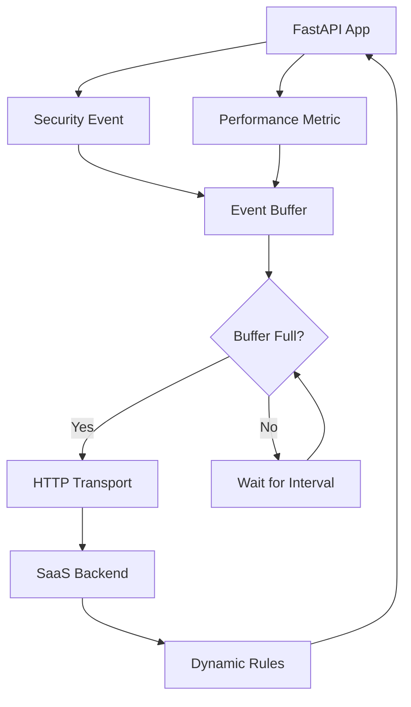

# Getting Started

This tutorial will guide you through setting up and using `fastapi-guard-agent` in your FastAPI application. By the end of this guide, you'll have a working integration that collects security events and metrics from your application.

## Overview

The FastAPI Guard Agent is a companion library to `fastapi-guard` that:

1. **Collects** security events and performance metrics from your FastAPI application
2. **Buffers** this data efficiently in memory (and optionally in Redis)
3. **Transmits** the data reliably to the FastAPI Guard SaaS backend
4. **Fetches** dynamic security rules to keep your application protection up-to-date

## Prerequisites

Before starting, ensure you have:

- **Python 3.8+** installed
- **`fastapi-guard-agent` installed** ([Installation Guide](../installation.md))
- **FastAPI application** (existing or new)
- **API credentials** from the FastAPI Guard SaaS platform
- **Redis server** (optional but recommended for production)

## Step-by-Step Setup

### Step 1: Basic Agent Configuration

First, let's create a minimal FastAPI application with the agent configured:

```python
# main.py
from fastapi import FastAPI
from guard_agent.client import guard_agent
from guard_agent.models import AgentConfig

app = FastAPI(title="My Secure API")

# Configure the Guard Agent
config = AgentConfig(
    api_key="your-api-key-here",           # Replace with your actual API key
    project_id="your-project-id",          # Replace with your project ID
    endpoint="https://api.fastapi-guard.com",  # Default SaaS endpoint
    buffer_size=100,                       # Buffer up to 100 events
    flush_interval=30,                     # Send data every 30 seconds
    enable_events=True,                    # Enable security event collection
    enable_metrics=True,                   # Enable performance metrics
)

# Initialize the agent (singleton pattern)
agent = guard_agent(config)

@app.get("/")
async def root():
    return {"message": "Hello, World!"}

@app.get("/health")
async def health():
    return {"status": "healthy"}

# Lifecycle management
@app.on_event("startup")
async def startup_event():
    """Start the agent when the application starts."""
    await agent.start()
    print("🚀 FastAPI Guard Agent started successfully!")

@app.on_event("shutdown")
async def shutdown_event():
    """Stop the agent when the application shuts down."""
    await agent.stop()
    print("🛑 FastAPI Guard Agent stopped successfully!")
```

### Step 2: Understanding Configuration Options

The `AgentConfig` model provides several configuration options:

```python
from guard_agent.models import AgentConfig

config = AgentConfig(
    # Required settings
    api_key="your-api-key",               # Your SaaS platform API key
    project_id="your-project-id",         # Your project identifier

    # Optional settings with defaults
    endpoint="https://api.fastapi-guard.com",  # SaaS platform endpoint
    buffer_size=100,                      # Max events in memory buffer
    flush_interval=30,                    # Seconds between data transmissions
    enable_events=True,                   # Collect security events
    enable_metrics=True,                  # Collect performance metrics
    max_payload_size=1024 * 1024,        # Max size for single payload (1MB)
    retry_attempts=3,                     # HTTP retry attempts
    retry_delay=1.0,                      # Initial retry delay (seconds)
    timeout=30.0,                         # HTTP request timeout
)
```

### Step 3: Understanding Data Flow

Here's how data flows through the agent:



**Data Flow Explanation:**

1. **Event Generation**: Your FastAPI application generates security events and metrics
2. **Buffering**: The agent buffers this data in memory (and optionally Redis)
3. **Transmission**: When the buffer fills up or the flush interval expires, data is sent
4. **Processing**: The SaaS backend processes the data and may return updated rules
5. **Rule Updates**: Dynamic security rules are applied to your application

### Step 4: Monitoring Events

To see the agent in action, let's add some basic monitoring:

```python
# enhanced_main.py
import asyncio
from fastapi import FastAPI, Request, HTTPException
from guard_agent.client import guard_agent
from guard_agent.models import AgentConfig, SecurityEvent, SecurityMetric
from guard_agent.utils import get_current_timestamp

app = FastAPI(title="My Secure API with Monitoring")

# Configure the agent
config = AgentConfig(
    api_key="your-api-key-here",
    project_id="your-project-id",
    buffer_size=50,                        # Smaller buffer for testing
    flush_interval=10,                     # More frequent flushes for testing
)

agent = guard_agent(config)

@app.middleware("http")
async def security_monitoring_middleware(request: Request, call_next):
    """Middleware to monitor requests and generate events."""
    start_time = get_current_timestamp()

    # Process the request
    response = await call_next(request)

    # Calculate response time
    end_time = get_current_timestamp()
    response_time = (end_time - start_time) * 1000  # Convert to milliseconds

    # Create a performance metric
    metric = SecurityMetric(
        timestamp=end_time,
        metric_type="response_time",
        value=response_time,
        metadata={
            "endpoint": request.url.path,
            "method": request.method,
            "status_code": response.status_code,
            "ip_address": request.client.host,
        }
    )

    # Send the metric to the agent
    await agent.send_metric(metric)

    # Example: Generate security event for certain conditions
    if response.status_code >= 400:
        event = SecurityEvent(
            timestamp=end_time,
            event_type="error_response",
            ip_address=request.client.host,
            endpoint=request.url.path,
            method=request.method,
            action_taken="log",
            reason=f"HTTP {response.status_code} response",
            metadata={
                "user_agent": request.headers.get("user-agent", ""),
                "response_time_ms": response_time,
            }
        )
        await agent.send_event(event)

    return response

@app.get("/")
async def root():
    return {"message": "Hello, World!", "timestamp": get_current_timestamp()}

@app.get("/error")
async def trigger_error():
    """Endpoint to test error event generation."""
    raise HTTPException(status_code=400, detail="This is a test error")

@app.get("/slow")
async def slow_endpoint():
    """Endpoint to test performance monitoring."""
    await asyncio.sleep(2)  # Simulate slow operation
    return {"message": "This was a slow operation"}

@app.get("/agent/status")
async def get_agent_status():
    """Get the current status of the Guard Agent."""
    status = await agent.get_status()
    return {
        "agent_status": status.status,
        "events_sent": status.events_sent,
        "metrics_sent": status.metrics_sent,
        "last_flush": status.last_flush,
        "buffer_size": status.buffer_size,
    }

# Lifecycle management
@app.on_event("startup")
async def startup_event():
    await agent.start()
    print("🚀 FastAPI Guard Agent started with monitoring!")

@app.on_event("shutdown")
async def shutdown_event():
    await agent.stop()
    print("🛑 FastAPI Guard Agent stopped!")
```

### Step 5: Testing Your Setup

Now let's test the integration:

1. **Start your application**:
   ```bash
   uvicorn main:app --reload
   ```

2. **Make some test requests**:
   ```bash
   # Normal request
   curl http://localhost:8000/

   # Trigger an error event
   curl http://localhost:8000/error

   # Trigger a slow response metric
   curl http://localhost:8000/slow

   # Check agent status
   curl http://localhost:8000/agent/status
   ```

3. **Monitor the logs**: You should see output like:
   ```
   🚀 FastAPI Guard Agent started with monitoring!
   INFO:     Application startup complete.
   ```

4. **Check agent status**: Visit `http://localhost:8000/agent/status` to see:
   ```json
   {
     "agent_status": "running",
     "events_sent": 5,
     "metrics_sent": 12,
     "last_flush": 1677123456.789,
     "buffer_size": 3
   }
   ```

## Common Patterns

### Development vs Production Configuration

**Development Configuration:**
```python
# config_dev.py
from guard_agent.models import AgentConfig

dev_config = AgentConfig(
    api_key="dev-api-key",
    project_id="my-app-dev",
    buffer_size=10,                # Small buffer for immediate feedback
    flush_interval=5,              # Frequent flushes for testing
    enable_events=True,
    enable_metrics=True,
)
```

**Production Configuration:**
```python
# config_prod.py
from guard_agent.models import AgentConfig

prod_config = AgentConfig(
    api_key="prod-api-key",
    project_id="my-app-prod",
    buffer_size=500,               # Larger buffer for efficiency
    flush_interval=60,             # Less frequent flushes
    enable_events=True,
    enable_metrics=True,
    retry_attempts=5,              # More retries for reliability
    timeout=60.0,                  # Longer timeout for stability
)
```

### Error Handling

Always include proper error handling:

```python
@app.on_event("startup")
async def startup_event():
    try:
        await agent.start()
        print("✅ Guard Agent started successfully")
    except Exception as e:
        print(f"❌ Failed to start Guard Agent: {e}")
        # Decide whether to continue without the agent or exit
        # For critical applications, you might want to exit:
        # import sys; sys.exit(1)

@app.middleware("http")
async def safe_monitoring_middleware(request: Request, call_next):
    response = await call_next(request)

    try:
        # Your monitoring logic here
        await agent.send_metric(metric)
    except Exception as e:
        # Log the error but don't fail the request
        print(f"Warning: Failed to send metric: {e}")

    return response
```

### Custom Event Processing

Create custom event processors for specific use cases:

```python
from guard_agent.models import SecurityEvent
from guard_agent.utils import get_current_timestamp

class CustomSecurityEventProcessor:
    def __init__(self, agent):
        self.agent = agent

    async def process_login_attempt(self, request: Request, success: bool, user_id: str = None):
        """Process login attempt events."""
        event = SecurityEvent(
            timestamp=get_current_timestamp(),
            event_type="login_attempt",
            ip_address=request.client.host,
            endpoint="/auth/login",
            method="POST",
            action_taken="log" if success else "block",
            reason="successful_login" if success else "failed_login",
            metadata={
                "user_id": user_id,
                "user_agent": request.headers.get("user-agent", ""),
                "success": success,
            }
        )
        await self.agent.send_event(event)

    async def process_suspicious_activity(self, request: Request, activity_type: str, severity: str):
        """Process suspicious activity events."""
        event = SecurityEvent(
            timestamp=get_current_timestamp(),
            event_type="suspicious_activity",
            ip_address=request.client.host,
            endpoint=request.url.path,
            method=request.method,
            action_taken="log" if severity == "low" else "alert",
            reason=activity_type,
            metadata={
                "severity": severity,
                "user_agent": request.headers.get("user-agent", ""),
            }
        )
        await self.agent.send_event(event)

# Usage
processor = CustomSecurityEventProcessor(agent)

@app.post("/auth/login")
async def login(request: Request, credentials: LoginCredentials):
    # Your login logic here
    success = authenticate_user(credentials)

    # Process the login event
    await processor.process_login_attempt(
        request,
        success,
        user_id=credentials.username if success else None
    )

    return {"success": success}
```

## Integration Testing

Create a simple test to verify your integration:

```python
# test_integration.py
import asyncio
import pytest
from httpx import AsyncClient
from main import app, agent

@pytest.mark.asyncio
async def test_agent_integration():
    """Test that the agent properly handles events and metrics."""

    # Start the agent
    await agent.start()

    try:
        async with AsyncClient(app=app, base_url="http://test") as client:
            # Make a normal request
            response = await client.get("/")
            assert response.status_code == 200

            # Make an error request
            response = await client.get("/error")
            assert response.status_code == 400

            # Check agent status
            response = await client.get("/agent/status")
            assert response.status_code == 200

            status = response.json()
            assert status["agent_status"] == "running"
            assert status["events_sent"] >= 0
            assert status["metrics_sent"] >= 0

    finally:
        # Stop the agent
        await agent.stop()

if __name__ == "__main__":
    asyncio.run(test_agent_integration())
```

## Next Steps

Now that you have a basic integration working, you can:

1. **[Configure Advanced Options](configuration.md)** - Learn about all configuration options
2. **[Set up Redis Integration](../guides/redis-integration.md)** - Add persistent buffering
3. **[Explore Full Integration](integration.md)** - Complete FastAPI Guard integration
4. **[Monitor & Troubleshoot](../guides/monitoring.md)** - Set up monitoring and alerting

## Troubleshooting

### Agent Not Starting

If the agent fails to start:

1. **Check your API credentials**:
   ```python
   # Test configuration
   config = AgentConfig(api_key="test", project_id="test")
   print(f"Config valid: {config}")
   ```

2. **Verify network connectivity**:
   ```bash
   curl -I https://api.fastapi-guard.com/health
   ```

3. **Check logs for detailed error messages**

### Events Not Being Sent

If events aren't reaching the backend:

1. **Check buffer configuration**: Lower `buffer_size` and `flush_interval` for testing
2. **Verify agent status**: Use the `/agent/status` endpoint
3. **Check network connectivity and firewall settings**

### Performance Issues

If the agent impacts performance:

1. **Increase buffer size** to reduce HTTP requests
2. **Increase flush interval** for less frequent transmissions
3. **Use Redis** for persistent buffering to reduce memory usage
4. **Monitor response times** and adjust configuration accordingly

Need more help? Check our [Troubleshooting Guide](../guides/troubleshooting.md) or [create an issue](https://github.com/rennf93/fastapi-guard-agent/issues).